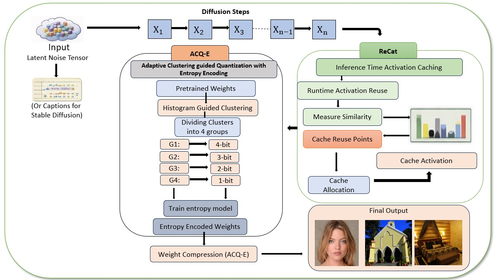

# ACQ-E+ReCaT
---
## 📖 INTRODUCTION

#### This repository contains official implementation of Unified Adaptive Quantization and Representation-Aware Caching for Diffusion Models paper.
#### This introduces- 
#### – ACQ-E, a histogram-guided clustering and adaptive mixed-precision quantization method for efficient weight storage, complementedby learned entropy encoding for compact model representation.
#### – ReCaT, a representation-aware activation caching strategy that selects effective caching points along the diffusion trajectory based on representational similarity measured using centered kernel alignment (CKA)[23].
#### – a unified framework that improves the runtime efficiency of diffusion models through representation-aware activation reuse and efficient weight storage, validated through extensive experimental evaluation.

---
## 🗝️ Environment <br>
#### Create and activate a suitable conda environment named equant by using the following commands:
```bash
cd E-Quant
conda env create -f environment.yaml
conda activate equant
```
---
## 💠 Download Checkpoints
```bash
bash mainldm/scripts/download_models.sh
```
---
## 📥 Stable Diffusion Checkpoint

This project requires the **Stable Diffusion v1.4 `.ckpt` model file**, which must be downloaded manually.

#### 1. Go to the model page:  
####   👉 [sd-v1-4](https://huggingface.co/CompVis/stable-diffusion-v-1-4-original)

#### 2. Click **Files and versions → `sd-v1-4.ckpt` → Download**.

---
## 📕 Data <br>
#### Please download all original datasets used for evaluation from each dataset’s official website.
---
## 🔧 Example Usage
#### These commands has to be run in sequence for image generation
```bash
python ./mainldm/stable_cali.py
```
```bash
python ./error_dec/stable/stable_dec.py --error cache
```
```bash
python ./mainldm/stable_params.py
```
```bash
python ./mainldm/stable_clustering_per_layer.py
```
```bash
python ./mainldm/stable_quant.py
```
